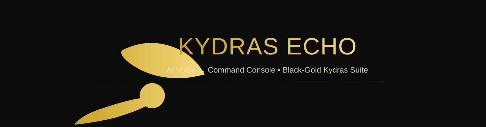

<p align="center">
  
</p>
<p align="center">  </p>


<p align="center">
  <a href="https://github.com/Kydras8/Kydras-Echo/releases"></a>
  <a href="https://github.com/Kydras8/Kydras-Echo/stargazers"></a>
  <a href="https://github.com/Kydras8/Kydras-Echo/issues"></a>
  <a href="https://github.com/Kydras8/Kydras-Echo/blob/main/LICENSE"></a>
  
</p>

<p align="center"><b>Real-time voice-to-text + hotkey command console.</b> Built for speed, packaged for ops, styled black-gold.</p>

---

## Features
- 🔊 Low-latency microphone capture → transcript
- ⚡ Hotkey command palette (speak → action)
- 🖥️ Windows/Kali first; macOS friendly
- 🛡️ Offline/online engines (switchable)
- 🧩 Plugin-friendly command bindings

## Quickstart

1) **Clone**
```powershell
git clone https://github.com/Kydras8/Kydras-Echo
cd Kydras-Echo

